# System Architecture

## 1. High-Level Architecture
This logical view illustrates how the React frontend interacts with the Node.js backend and external services.

```mermaid
flowchart TD
    %% Nodes
    Client[("💻 Client (Browser)
    React.js + Ace Editor")]
    
    subgraph Services ["External Services"]
        Auth[("🔐 Google OAuth
        (Identity Provider)")]
        JDoodle[("🚀 JDoodle API
        (Code Compilation)")]
        WebRTC_Mesh[("🕸️ WebRTC Mesh
        (P2P Signals)")]
    end
    
    subgraph Backend ["Backend Infrastructure (Node.js)"]
        Server[("⚙️ Express API
        (Room Management)")]
        Socket[("⚡ Socket.io Server
        (Signaling & State)")]
        DB[("🗄️ MongoDB
        (Persistent Storage)")]
    end

    %% Connections
    Client -- "1. Login (Google)" --> Auth
    Client -- "2. Verify/Login" --> Server
    Server -- "3. User Data" <--> DB
    
    Client -- "4. Sync (Diff-Match-Patch)" <--> Socket
    Socket -- "5. Signaling" --> Client
    
    Client -- "6. Compile Request" --> Server
    Server -- "7. Proxy Code" --> JDoodle
    JDoodle -- "8. Output output" --> Server
    
    Client -.-> WebRTC_Mesh
    WebRTC_Mesh -.-> Client
    
    %% Styling
    classDef box fill:#fff,stroke:#333,stroke-width:2px,color:#000;
    class Client,Auth,Server,Socket,DB,JDoodle,WebRTC_Mesh box
```

## 2. Database Design (ER Diagram)
The data model for users and rooms in MongoDB.

## 3. Real-time Collaboration (Sequence Diagram)
How code changes are synchronized between multiple users using Differential Synchronization.

## 4. Video Chat Signaling (State Diagram)
The signaling process to establish a P2P connection via the Socket.io server.

