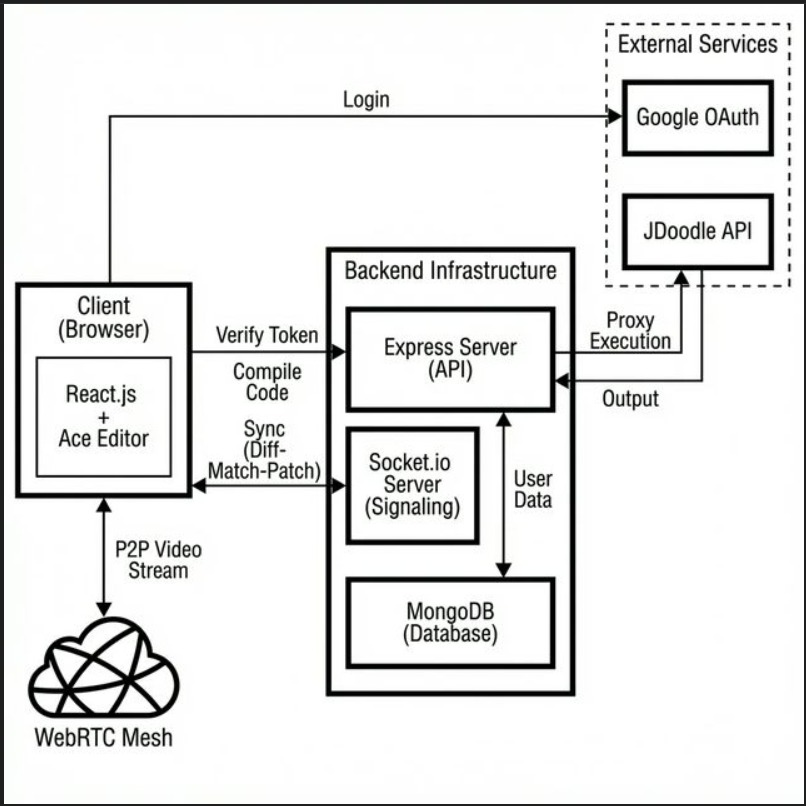

# CodeCast

CodeCast is a powerful **Real-time Collaborative Code Editor** that enables developers to write, debug, and execute code together in real-time. Beyond just code, it features built-in **Video & Audio Chat** and a collaborative **Whiteboard**, offering a complete environment for remote interviews, pair programming, and teaching.

## 🚀 Features

-   **Real-time Code Collaboration**: Edit code simultaneously with other users with low latency.
-   **Video & Audio Chat**: Integrated peer-to-peer video conferencing using WebRTC.
-   **Collaborative Whiteboard**: Draw, sketch, and visualize ideas in real-time on a shared canvas.
-   **Multi-language Support**: Code support for various programming languages via Ace Editor.
-   **Room Management**: Create private rooms, join via ID, and manage sessions.
-   **Secure Authentication**: User sign-up/login with JWT and Google Auth support.
-   **Compile & Run**: Execute code in C++, Java, Python, Go, C#, Node.js, and Rust via the JDoodle API.

## 🛠️ Tech Stack

### Frontend
-   **React.js**: UI Library.
-   **Material UI (MUI)**: Component library for a polished look.
-   **Ace Editor**: The lightweight code editor engine.
-   **Socket.io-client**: For real-time updates (code, chat, whiteboard).
-   **Simple-Peer (WebRTC)**: For peer-to-peer video/audio streaming.
-   **Fabric.js**: For the interactive whiteboard.
-   **Axios**: For API requests.

### Backend
-   **Node.js & Express.js**: REST API and server logic.
-   **Socket.io**: Real-time bidirectional event-based communication.
-   **MongoDB & Mongoose**: NoSQL database for storing users and room data.
-   **JDoodle API**: For compiling and executing code remotely.
-   **JWT & Bcrypt**: Authentication and security.
-   **Nodemailer**: For email notifications (if configured).

## 🏗️ Architecture



For a detailed deep-dive into the database design, real-time sync flow, and WebRTC signaling, see [ARCHITECTURE.md](./ARCHITECTURE.md).

## 📂 Project Structure

```
code-cast-app/
├── Code-Cast-backend/      # Server-side code (Node/Express)
│   ├── src/
│   │   ├── controllers/    # Request handlers
│   │   ├── DB/             # Database connection & schemas
│   │   ├── Routes/         # API Routes
│   │   ├── index.js        # Entry point
│   │   └── ...
├── Code-Cast-Frontend/     # Client-side code (React)
│   ├── src/
│   │   ├── Components/     # Reusable UI components
│   │   ├── Room/           # Main Room logic (Editor, Video, Whiteboard)
│   │   ├── App.jsx         # Main App component
│   │   └── ...
└── README.md
```

## ⚙️ Installation & Setup

> [!IMPORTANT]
> **Configuration Required**: This project currently has hardcoded API URLs in the frontend pointing to a deployed instance (`https://codewithme-backend.onrender.com`).
> To run this locally, you **MUST** replace these URLs with `http://localhost:8080` (or your local backend URL) in the following files:
> - `Code-Cast-Frontend/src/Components/Login.jsx`
> - `Code-Cast-Frontend/src/Room/CodeEditor.jsx`

### Prerequisites
-   Node.js (v14+ recommended)
-   MongoDB (Local or Atlas URI)
-   **JDoodle API Credentials** (Free tier available at [jdoodle.com](https://www.jdoodle.com/compiler-api/))

### 1. Clone the Repository
```bash
git clone <repository-url>
cd code-cast-app
```

### 2. Backend Setup
Navigate to the backend directory and install dependencies:
```bash
cd Code-Cast-backend
npm install
```

Create a `.env` file in the `Code-Cast-backend` root with the following variables:
```env
PORT=8080
mongo_url=your_mongodb_connection_string
JWT_SECRET=your_jwt_secret
BASE_URL=http://localhost:8080

# JDoodle API (Required for Code Execution)
CLIENT_ID=your_jdoodle_client_id
CLIENT_SECRET=your_jdoodle_client_secret

# Optional (for email features)
GMAIL_EMAIL=your_email@gmail.com
GMAIL_PASSWORD=your_email_app_password
```

Start the backend server:
```bash
npm start
# OR for development with nodemon
npm run dev
```

### 3. Frontend Setup
Navigate to the frontend directory and install dependencies:
```bash
cd ../Code-Cast-Frontend
npm install
```

Start the React development server:
```bash
npm start
```
The application should now be running at `http://localhost:3000`.

## 🤝 Contributing

Contributions are welcome! Please fork the repository and create a pull request with your changes.

1.  Fork the Project
2.  Create your Feature Branch (`git checkout -b feature/AmazingFeature`)
3.  Commit your Changes (`git commit -m 'Add some AmazingFeature'`)
4.  Push to the Branch (`git push origin feature/AmazingFeature`)
5.  Open a Pull Request

## 📄 License

This project is licensed under the ISC License.
